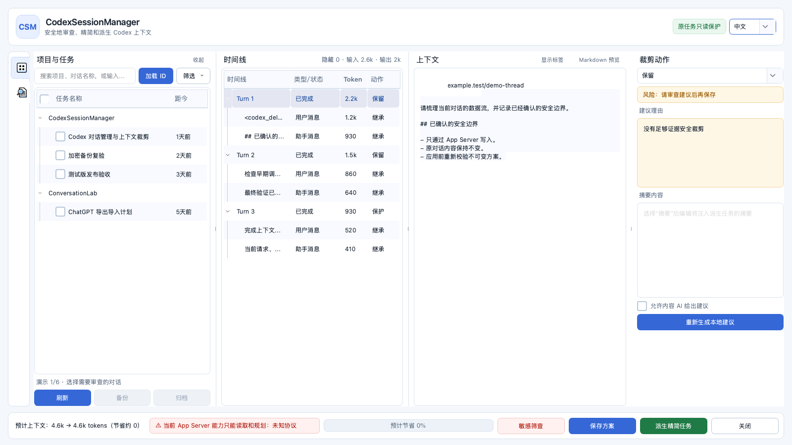
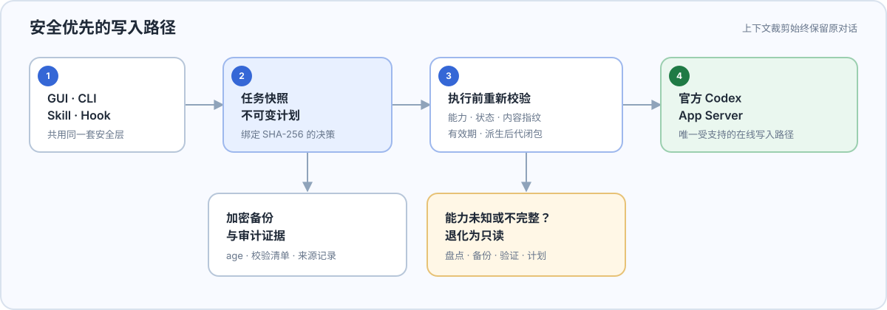
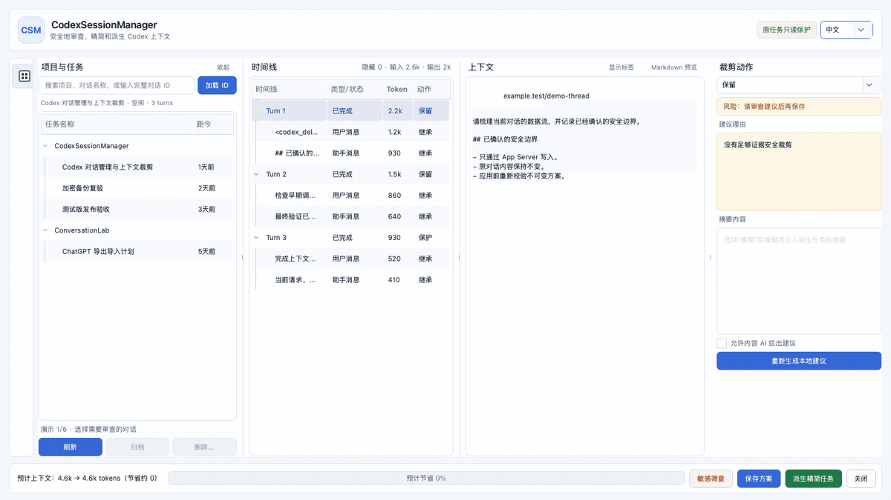

# CodexSessionManager

<p align="center">
  
</p>

<p align="center">
  <strong>面向 Codex 对话盘点、备份、清理、导入和上下文裁剪的安全优先 GUI 与 CLI。</strong><br>
  <a href="README.md">English</a> · 简体中文 · <a href="docs/CodexSessionManager-GUI-Guide-bilingual.pptx">双语 GUI 操作指南</a>
</p>

长期使用 Codex 后，对话会分散在多个项目中，上下文也会持续膨胀。CodexSessionManager 将审查、加密备份、安全清理与无损上下文裁剪集中到一个可审计的桌面工具中。

<a id="features"></a>
## ✨ 功能特性

- 按项目、活跃时间、来源和父子关系分组、搜索 Codex 对话。
- 以流式方式创建 age 加密 `.csmbackup`，并执行完整性复验。
- 从 GUI 对选中任务及其完整派生后代创建 recipient 加密备份，复验成功后再单独进入归档计划。
- 所有归档、恢复、导入、裁剪和清除写操作均先生成不可变计划。
- 生成脱敏 App Server schema 审计报告；未知画像保持只读，不能自动加入写入信任列表。
- 通过派生任务精简上下文，原对话内容始终保持不变。
- 审查模型可见内容、Markdown、隐藏标签、依赖关系和预计 Token 节省量。
- 使用有界后台多线程在本地筛查疑似凭据和个人信息，通过可取消的模态进度窗口反馈进度，并对命中内容进行醒目标记。
- 支持 GUI、CLI、显式调用 Codex Skill，以及可选的 fail-open PreCompact/PostCompact Hook。
- 提供自包含 macOS arm64 与 Windows x64 包，无需最终用户安装 Python、Qt、uv 或 age。

### 安全默认值对比

| 需求 | 临时或手工作业方式 | CodexSessionManager |
| --- | --- | --- |
| 审查大量对话 | 分别搜索项目和原始历史 | 按项目分组盘点并统一查看时间线 |
| 清理旧对话 | 缺少可复现依据便直接删除或归档 | dry-run 计划、指纹校验、后代展开，再通过 App Server 写入 |
| 精简上下文 | 改写原历史或接受一次性整体压缩 | 在新派生任务中保留、排除、摘要或保护内容 |
| 备份与迁移 | 复制内部文件并依赖版本恰好兼容 | 加密逻辑记录、校验清单、来源信息、完整复验和新 ID 恢复 |

<a id="quick-start"></a>
## ⚙️ 快速开始

> [!WARNING]
> `v1.0.0` 是**测试版 prerelease**。macOS 包仅作 ad-hoc 签名且未经公证；Windows 包未签名。启动前必须核对同名 SHA-256 文件，不要将这两个包视为生产版本。

> [!NOTE]
> 当前 `main` 源码版本为 `1.1.0` 首次交付候选，尚未发布对应二进制。下列下载链接仍指向已发布的 `v1.0.0` 测试版。

**运行条件**

- 发布包：Apple Silicon macOS 或 Windows x64；需要本机已有 Codex App/CLI，才能访问 App Server。
- 源码运行：[uv](https://docs.astral.sh/uv/) 与 Git。uv 会管理项目固定的 CPython 3.13.14 环境。

### 1. 下载测试版

从 [`v1.0.0` 测试版](https://github.com/Aiyawoc/CodexSessionManager/releases/tag/v1.0.0)下载压缩包及对应 `.sha256` 文件：

- [macOS arm64 ZIP](https://github.com/Aiyawoc/CodexSessionManager/releases/download/v1.0.0/CodexSessionManager-macOS-arm64-1.0.0-test.zip) · [SHA-256](https://github.com/Aiyawoc/CodexSessionManager/releases/download/v1.0.0/CodexSessionManager-macOS-arm64-1.0.0-test.zip.sha256)
- [Windows x64 ZIP](https://github.com/Aiyawoc/CodexSessionManager/releases/download/v1.0.0/CodexSessionManager-Windows-x64-1.0.0-test.zip) · [SHA-256](https://github.com/Aiyawoc/CodexSessionManager/releases/download/v1.0.0/CodexSessionManager-Windows-x64-1.0.0-test.zip.sha256)

### 2. 校验并启动

macOS arm64：

```bash
shasum -a 256 -c CodexSessionManager-macOS-arm64-1.0.0-test.zip.sha256
ditto -x -k CodexSessionManager-macOS-arm64-1.0.0-test.zip .
"./CodexSessionManager.app/Contents/MacOS/CodexSessionManager" cli doctor
"./CodexSessionManager.app/Contents/MacOS/CodexSessionManager"
```

Windows x64 PowerShell：

```powershell
$Archive = ".\CodexSessionManager-Windows-x64-1.0.0-test.zip"
$Expected = ((Get-Content "$Archive.sha256").Trim() -split '\s+')[0]
$Actual = (Get-FileHash $Archive -Algorithm SHA256).Hash
if ($Actual.ToLower() -ne $Expected.ToLower()) { throw "SHA-256 mismatch" }
Expand-Archive $Archive -DestinationPath . -Force
PowerShell -NoProfile -ExecutionPolicy Bypass -File .\CodexSessionManager-Windows-x64\Install-CodexSessionManager.ps1
& "$env:LOCALAPPDATA\CodexSessionManager\CodexSessionManager.exe"
```

也可以直接从源码运行基础 GUI 与 CLI：

```bash
uv sync --locked --compile-bytecode
uv run csm --help
uv run CodexSessionManager
```

备份复验和完整 `doctor` 检查还需要 `age` 可执行文件。平台构建脚本会获取并验证固定版本；开发环境也可以通过 `CSM_AGE_BIN` 指定已有 age。

### 3. 完成最小 GUI 操作

1. 搜索项目或对话，也可以输入完整对话 ID。
2. 选择 turn 或 item，然后设置为**保留、排除、摘要或保护**。
3. 使用**保存方案**只保存已审查计划；使用**派生精简任务**创建新的精简对话。
4. 在对话清理模式中调整最终候选后使用**备份并归档**；程序会先完整复验 age 备份，再重建最终计划并归档。普通任务管理仍可分开执行备份与归档。

### 构建与发布状态

[](https://github.com/Aiyawoc/CodexSessionManager/actions/workflows/ci.yml)
[](https://github.com/Aiyawoc/CodexSessionManager/releases)


[](LICENSE)

> [!NOTE]
> 本项目代码完全由 ChatGPT 生成。代码仍必须经过人工审查、自动化测试和目标平台验证；在依赖任何写操作前，请独立检查实现与测试证据。

<a id="contents"></a>
## 目录

- [✨ 功能特性](#features)
- [⚙️ 快速开始](#quick-start)
- [📌 适用场景](#use-cases)
- [安全模型](#safety-model)
- [📖 使用文档](#documentation)
- [🔧 配置说明](#configuration)
- [开发、测试与打包](#development)
- [❓ 常见问题 FAQ](#faq)
- [🤝 贡献指南](#contributing)
- [📄 开源协议](#license)

<a id="use-cases"></a>
## 📌 适用场景

| 场景 | CSM 提供的能力 |
| --- | --- |
| 长期维护多个 Codex 项目 | 按项目分组的对话列表、搜索、距今时间、多选和关系追踪 |
| 上下文即将触发压缩 | 用户手动审查，或在原生压缩前使用可选 PreCompact 轻提示 |
| 清理较旧或长期未活动对话 | 本地规则候选、dry-run 归档计划、批次上限和人工确认 |
| 对话备份或跨账号迁移 | CSM 加密备份、逻辑恢复、Codex rollout 导入和 ChatGPT 导出分支展开 |
| 敏感内容排查 | 不上传对话内容的有界后台并行筛查、可取消进度和红色高亮 |
| 需要可审计的维护流程 | 不可变计划哈希、来源指纹、能力校验和 CSM 自有审计链 |

本项目主要面向在多个仓库中长期使用 Codex、需要管理大量对话，或希望避免直接操作 Codex 内部存储的开发者与维护者。

<a id="safety-model"></a>
## 安全模型



- Codex 在线读取和写入只通过官方 App Server；CSM 不改写 Codex JSONL 或 SQLite。
- 协议能力未知、不完整或未经审计时停止写入，但仍开放盘点、备份、验证和计划。
- 协议审计比较稳定/实验方法、方法新增/移除/稳定性变化和关键字段；只有版本与 schema 哈希精确命中人工批准画像才开放写入。
- 每个写操作都消费绑定 SHA-256 的计划，并重新校验状态、内容指纹、协议能力、有效期和 spawned descendants。
- 自动操作最多归档。永久清除必须使用单根独立计划、已验证备份证据、可信归档历史和明确人工确认。
- 上下文裁剪只创建新任务；原任务保持不变，系统/开发者指令从当前项目重新加载。
- 工具调用与结果、文件变更与验证按组保留或摘要，不拆成不安全的片段。
- Hook 采用 fail-open：超时、关闭、崩溃或启动失败时继续 Codex 原生压缩。

<a id="documentation"></a>
## 📖 使用文档

### 稳定用户级安装

直接运行解压出的 macOS App 不会安装 Skill 或 CLI 启动器。在与发布标签一致的源码检出中，可安装到稳定用户路径：

```bash
scripts/install_user.sh /absolute/path/to/CodexSessionManager.app
~/.local/bin/csm doctor
```

安装器会原子替换 `~/Applications/CodexSessionManager.app`、保留上一版本用于回退、创建 `~/.local/bin/csm`，并链接 App 内 Skill。快速开始中的 Windows 安装器会在 `%LOCALAPPDATA%\CodexSessionManager` 完成等效的用户级安装。两个安装器都不会自动启用 Hook。

### GUI 操作流程

直接启动 CodexSessionManager 会打开原有的项目/任务、时间线、上下文和动作审查 GUI。上下文优化继续使用这套完整界面；对话清理请求会把 LLM/Skill 初筛候选按项目灌入原任务列表并预选，同时列出当前真实盘点中可由用户主动补选的安全根目标。满足 14 天可信归档和当前备份证据门禁的永久删除候选只在独立只读分组中展示，默认不选中，也不会进入归档流程。左侧工具栏第二个按钮切换到记忆管理模式，继续复用相同窗口布局；它只加载用户明确登记的 UTF-8 Markdown/文本文件，按结构拆分后支持保留、删除、替换和保护，并在写入前展示完整 diff、创建私有版本备份、复核并发漂移、原子替换和重读验证。待处理计划与备份/恢复继续作为辅助入口，不替代主审查 GUI。

<p align="center">
  
</p>
<p align="center"><sub>12 秒可复现演示 · 对话 ID、路径、仓库与对话内容均为虚构数据</sub></p>

1. **项目与任务**按项目 cwd 或 Git remote 对话分组。搜索和完整 ID 加载共用一个输入框，多选操作仍受安全门禁约束。
2. **时间线**显示模型可见的 turn/item，并默认过滤空内部事件；Token 数量使用紧凑单位。
3. **上下文**内容可编辑，支持显示隐藏标签、分段渲染、Markdown 预览和本地敏感命中高亮。
4. **裁剪动作**支持 `keep`、`exclude`、`summary` 和 `protect`。当前请求、进行中 turn、有效目标、未解决错误和未知 item 等硬保护内容不能被静默删除。
5. **清理候选补选**把 LLM 建议与本地当前安全候选清晰区分：LLM 建议默认预选，本地补选默认不选；两者在最终计划和备份前都重新检查完整后代闭包。
6. **永久删除资格**只读展示已归档至少 14 天、具有可信归档历史和当前有效备份的根候选；这里不生成删除计划，永久删除仍要求独立流程和精确确认。
7. **外部建议灌入**只接受本地重新绑定的对话、turn 或 item ID 与当前指纹；硬保护和 `validate_selections` 始终拥有最终否决权。
8. **记忆管理**通过左侧第二按钮进入同一窗口壳。只有已登记来源可见；LLM 建议会先绑定当前 segment ID 与内容 SHA-256，标题、front matter、代码块和结构空白仍受本地硬保护。用户确认后先创建版本，再原子写入并重读验证。
9. **备份并归档**在清理模式中先冻结根及全部后代范围、创建并完整复验 age 备份，再重读状态和建议指纹、重建最终计划并归档；漂移或验证失败会停止归档。普通任务管理中的“备份并复验”仍不会隐式归档。

“保存方案”只将已审查的 `TrimPlan` 写入 CSM 数据目录，不修改 Codex。“派生精简任务”会先重新校验计划、等待原任务处于 `idle` 或 `notLoaded`，再创建新的派生任务。

### CLI 工作流

```bash
csm doctor
csm schema audit --output schema-audit-v1.json
csm threads list
csm threads show CONVERSATION_ID --include-content
csm gui open --page pending
csm trim review CONVERSATION_ID
csm memory sources
csm memory review SOURCE_ID
csm acceptance run --output acceptance-first-delivery.json
csm audit show
```

可先生成不执行写入的清理建议，再进入计划与备份流程：

```bash
csm cleanup review --older-than-days 90
csm backup create backup.csmbackup \
  --thread CONVERSATION_ID \
  --recipient age1... \
  --identity /secure/path/identity.txt
csm cleanup plan --action archive --older-than-days 90
csm cleanup apply PLAN.json --confirm PLAN_ID
```

主要命令组：

| 命令 | 用途 |
| --- | --- |
| `csm threads list\|show` | 只读盘点与内容查看 |
| `csm schema audit` | 生成不含私有路径或对话内容的版本化协议差异报告 |
| `csm acceptance report` | 汇总固定阶段、散列任务 ID 与证据哈希；始终标记非生产验收 |
| `csm backup create\|verify` | 流式 age 加密备份与完整复验 |
| `csm cleanup review` | 生成密封清理建议并灌入原项目/任务 GUI，由用户最终选择 |
| `csm cleanup eligible-purge` | 只读列出满足可信归档龄期和当前备份门禁的永久删除根候选 |
| `csm cleanup plan\|apply` | 计划式归档/反归档工作流 |
| `csm purge plan\|apply` | 独立门禁的永久删除工作流 |
| `csm restore plan\|apply` | 使用新对话 ID 进行逻辑恢复 |
| `csm import {chatgpt\|codex} ...` | 规划并应用官方 ChatGPT 导出或 Codex rollout 数据导入 |
| `csm trim review\|suggest\|apply` | GUI/人工审查、本地建议与派生裁剪 |
| `csm memory ...` | 登记、分段审查、diff、版本备份、原子写入与恢复本地记忆文件 |
| `csm gui open` | 打开原审查 GUI 的指定模式或密封请求；pending/backup 使用辅助入口 |
| `csm acceptance run\|release` | 运行隔离的首次交付检查；release 额外要求 age 与稳定安装包 |
| `csm hook install\|status\|uninstall` | 可选 PreCompact/PostCompact 集成 |
| `csm audit show\|verify` | 查看并验证 CSM 审计链 |

口令模式由 age 直接从终端读取口令。不要把备份口令写入命令参数、环境变量、日志、Issue 或模型上下文。GUI 和无人值守工作流应使用 age recipient。

### Codex Skill

稳定安装器会把 `manage-codex-sessions` 安装到 `~/.agents/skills`。重启 Codex 后显式调用：

```text
$manage-codex-sessions 打开当前对话的上下文裁剪
```

Skill 不会在普通编码任务中自动运行。它会解析稳定的 `csm` 启动器或 App 内可执行文件，并与 GUI、CLI 共用同一套计划和安全门禁。

### MCP Streamable HTTP 服务

CSM 内置一个只读编排边界的 MCP HTTP 服务。它只提供候选盘点、结构化建议准备、打开本地审查 GUI 和查询请求状态；不会暴露归档、永久删除、上下文应用或记忆写入执行工具。

公网 Tunnel 前应设置本地环境变量中的 Bearer token，不要把 token 写入命令行、配置仓库或模型上下文：

```bash
export CSM_MCP_BEARER_TOKEN='在本地安全生成的长随机值'
csm mcp serve --host 127.0.0.1 --port 8765 --path /mcp
```

健康检查位于 `/healthz`，MCP 端点为 `/mcp`。Cloudflare Tunnel 应把 HTTPS 域名转发到该回环地址，并保留或增加独立访问策略。`--allow-unauthenticated-local` 只用于显式回环地址上的本机测试，不能用于公网 Tunnel。

当前注册工具：

```text
inspect_conversation_inventory
prepare_cleanup_suggestions
open_cleanup_review
prepare_context_suggestions
open_context_review
inspect_memory_source
prepare_memory_suggestions
open_memory_review
get_pending_review_status
open_review_demo
```

这些工具生成的建议和请求仍需由原 GUI 中的用户最终确认。记忆工具只接受已登记的 source ID，不接受任意文件路径，也不暴露写入执行器。真实 ChatGPT 连接器、Tunnel 认证和已安装应用端到端联调属于独立验收项。

### 可选 Hook

```bash
csm hook status
csm hook install --yes
csm hook uninstall --yes
```

安装 App 不会静默启用 Hook。安装 Hook 后仍需在 Codex `/hooks` 中审查并信任具体命令。PreCompact 会先显示轻提示；只有方案成功持久化后才返回 `continue: false`，也不会在进行中的 turn 内创建派生任务。

### 延伸文档

- [双语 GUI 操作指南（PPTX）](docs/CodexSessionManager-GUI-Guide-bilingual.pptx)
- [Skill 命令工作流](skills/manage-codex-sessions/references/commands.md)
- [Skill 安全不变量](skills/manage-codex-sessions/references/safety.md)
- [领域语言与关系](CONTEXT.md)
- [架构决策记录](docs/adr/)
- [App Server schema 人工批准流程](docs/acceptance/app-server-schema-approval.md)
- [`v1.1.0` 首次交付验收 Runbook](docs/acceptance/first-delivery-v1.1.0.md)
- [`v1.1.0` 首次交付候选说明](docs/releases/v1.1.0-first-delivery.md)
- [`v1.0.1` macOS 真实账号验收 Runbook](docs/acceptance/macos-real-account-v1.0.1.md)
- [`v1.0.1` 加固候选说明](docs/releases/v1.0.1-test.md)
- [`v1.0.0` 测试版说明](docs/releases/v1.0.0-test.md)
- [项目开发约束](AGENTS.md)

<a id="configuration"></a>
## 🔧 配置说明

CSM 默认使用各平台的用户级标准目录。环境变量主要用于明确选择账号、隔离测试或高级安装场景。

| 环境变量 | 用途 |
| --- | --- |
| `CSM_CODEX_HOME` | CSM 使用的明确 Codex 数据根目录 |
| `CODEX_HOME` | Codex 官方数据根覆盖；两个 home 变量同时设置时必须解析到同一路径 |
| `CSM_CODEX_BIN` | Codex CLI/App Server 启动器的绝对路径或命令名 |
| `CSM_APP_PATH` | 生成 Hook 命令时使用的稳定 App 根目录或可执行文件 |
| `CSM_DATA_DIR` | 计划、导入、备份和审计数据库目录 |
| `CSM_CONFIG_DIR` | CSM 配置目录 |
| `CSM_CACHE_DIR` | 缓存目录 |
| `CSM_LOG_DIR` | 应用与 Hook 日志目录 |
| `CSM_AGE_BIN` | 仅用于开发环境的 age 路径覆盖；standalone 使用已验证的内置二进制 |

如果 `CSM_CODEX_HOME` 与 `CODEX_HOME` 指向不同目录，所有入口都会拒绝继续，避免把一个账号的任务状态与另一个账号的计划或审计证据混用。

稳定安装路径为 macOS 的 `~/Applications/CodexSessionManager.app` 和 Windows 的 `%LOCALAPPDATA%\CodexSessionManager`。Hook 必须指向稳定安装位置，不能指向源码目录或 `.venv`。

<a id="development"></a>
## 开发、测试与打包

### 开发环境

```bash
git clone https://github.com/Aiyawoc/CodexSessionManager.git
cd CodexSessionManager
uv sync --locked --compile-bytecode
scripts/check.sh
csm acceptance run --output acceptance-first-delivery.json
```

`scripts/check.sh` 会检查 Qt 生成文件、Ruff 格式与 lint、严格 mypy、PySide6 offscreen 测试和 Skill 契约。源码、安装、Skill、Hook 和生命周期还可以分别运行：

```bash
scripts/test_source_workflow.sh
scripts/test_install_workflow.sh dist/CodexSessionManager.app
scripts/test_skill_workflow.sh dist/CodexSessionManager.app
scripts/test_hook_workflow.sh dist/CodexSessionManager.app
scripts/test_full_workflow.sh
```

这些检查只使用隔离临时数据，不能替代真实账号 App Server 联调、实体设备 UI 验收、签名与公证、SmartScreen 信誉或生产验收。

`CI` 工作流在 `macos-15` 上显式断言 `arm64` 并运行完整源码工作流，同时保留 Windows 检查。手动 `build-macos` 工作流始终从当前源码运行 `scripts/test_full_workflow.sh`，不使用 `--reuse-app`；托管 runner 不假定安装了 Codex，因此只跳过 bundle 内的 App Server 联通检查，不能据此声称真实账号验收。

在 macOS 上对当前 Codex home 的副本进行测试：

```bash
scripts/install_test_app.sh
scripts/launch_test_app.sh /absolute/path/printed/as/TEST_ROOT
```

复制出的测试目录可能包含认证信息。条件允许时先退出 Codex，并且只删除安装器打印的精确 `TEST_ROOT`。

### 桌面打包

在真实 Apple Silicon macOS 上构建 arm64：

```bash
scripts/build_macos_app.sh
scripts/accept_macos_bundle.sh dist/CodexSessionManager.app
scripts/accept_first_delivery.sh \
  --evidence-dir build/first-delivery-bundle-$(date +%Y%m%d-%H%M%S) \
  --app dist/CodexSessionManager.app
scripts/package_macos_release.sh --app dist/CodexSessionManager.app
```

最后一个脚本会先验收原 `.app`，再创建 ZIP 和 `.sha256`，解压到干净临时目录并再次验收，不覆盖既有资产。测试通道文件名带 `-test`；正式公开发布仍需要 Developer ID 签名、公证和 staple。

在 Windows AMD64 或手动 GitHub Actions 工作流中构建 Windows x64：

```powershell
.\scripts\check_windows.ps1
.\scripts\build_windows_app.ps1 -Version 1.1.0
```

两个平台均使用 `pyside6-deploy` / Nuitka standalone，并携带固定版本的 Python、Qt、插件、应用依赖和已验证 age 二进制。正式公开分发仍要求 macOS Developer ID 签名、公证与 staple，以及适当的 Windows Authenticode 签名。

<a id="faq"></a>
## ❓ 常见问题 FAQ

<details>
<summary><strong>CSM 会修改 Codex JSONL 或 SQLite 吗？</strong></summary>

不会。在线读取与写入通过 App Server 完成。原始 rollout 数据可以作为加密灾备内容保留，但 CSM 不把直接编辑内部文件视为受支持的恢复或裁剪接口。
</details>

<details>
<summary><strong>最终用户需要安装 Python、uv、Qt 或 age 吗？</strong></summary>

使用 standalone 包时不需要。macOS 和 Windows 包已携带独立运行时与已验证 age。源码开发需要 uv；uv 会获取固定 Python 版本，不修改系统 Python。
</details>

<details>
<summary><strong>为什么 Gatekeeper 或 SmartScreen 会警告？</strong></summary>

`v1.0.0` 明确是测试版。macOS 仅作 ad-hoc 签名且未经公证；Windows 没有 Authenticode 签名和 SmartScreen 信誉。请先核对发布页校验值与来源，不要绕过未验证文件的安全警告。
</details>

<details>
<summary><strong>为什么对话列表为空，或 App Server 不可用？</strong></summary>

先运行 `csm doctor`。确认 Codex CLI 已安装且可访问，或用 `CSM_CODEX_BIN` 指向其绝对路径；同时检查 `CODEX_HOME` 与 `CSM_CODEX_HOME` 是否指向预期且相同的数据根。
</details>

<details>
<summary><strong>“保存方案”和“派生精简任务”有什么区别？</strong></summary>

**保存方案**只把已审查的不可变方案写入 CSM 数据目录。**派生精简任务**会重新校验该方案并创建新的 Codex 任务，原任务保持不变。
</details>

<details>
<summary><strong>CSM 能永久删除对话吗？</strong></summary>

可以，但绝不会自动执行。永久清除需要独立不可变计划、已验证加密备份、可信归档证据、等待期检查、后代展开和明确人工确认；自动操作最多归档。
</details>

<details>
<summary><strong>敏感筛查能证明某个密钥有效或已经泄露吗？</strong></summary>

不能。它使用本地确定性模式，并在适用时做校验和验证。它可能误报，也可能漏掉不常见格式；该功能只用于辅助审查，不是凭据验证服务。
</details>

<details>
<summary><strong>能否合并其它账号的对话？</strong></summary>

CSM 可以为 CSM 备份、Codex rollout 数据和官方 ChatGPT 导出生成逻辑导入计划。导入对话使用新 ID、保留来源信息且不重放工具调用；无法确认的项目映射会进入隔离区等待审查。
</details>

<details>
<summary><strong>当前发布支持哪些平台？</strong></summary>

测试版覆盖 macOS arm64 与 Windows x64，尚未发布 Intel macOS 或 Linux 包。目标平台验收必须在对应真实平台或 GitHub Windows runner 上完成。
</details>

<a id="contributing"></a>
## 🤝 贡献指南

欢迎提交范围明确的 Issue 和 Pull Request。

1. 描述问题、预期行为、复现范围与平台；不要附带凭据或真实对话数据。
2. 行为变化需要新增或更新测试；GUI、CLI、Skill 和 Hook 必须继续共用计划与安全层。
3. 提交 PR 前运行 `scripts/check.sh` 及相关专项工作流。
4. 用户可见命令、平台支持或安全行为变化时，同步更新中英文 README。

修改实现前请先阅读 [AGENTS.md](AGENTS.md)。不要增加直接 Codex JSONL/SQLite 写入、Hook 内隐式联网安装，或绕过不可变计划的写入路径。

当前项目代码完全由 ChatGPT 生成，但生成代码不会自行完成验证。无论贡献来源如何，都必须经过人工审查、可复现测试和诚实的目标环境证据。

<a id="license"></a>
## 📄 开源协议

CodexSessionManager 使用 [MIT License](LICENSE)。打包的依赖与工具保留各自许可证，详见 [THIRD_PARTY_NOTICES.md](THIRD_PARTY_NOTICES.md)。

⭐ 如果本项目对你有帮助，欢迎 Star 支持，我会持续维护迭代。

## 🗺️ 记忆文件管理状态

首次交付已实现：显式来源登记、路径/符号链接边界、UTF-8 Markdown/文本分段、稳定 segment ID、`KEEP/DELETE/REPLACE/PROTECT`、LLM 建议指纹绑定、原 GUI 最终确认、unified diff、私有版本、并发漂移检测、原子写入、重读验证、审计和计划式恢复。该功能不管理 ChatGPT 账号的服务器端 Memory。

后续增强项包括：全文搜索、更丰富的 Markdown 语义、可选加密记忆版本、跨文件批量方案，以及在真实 Windows 安装包中的专项 UI 验收。
