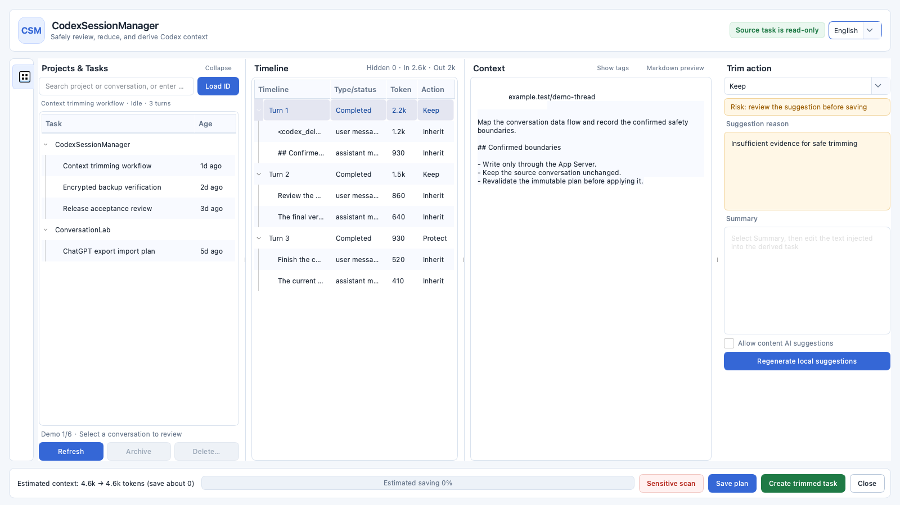
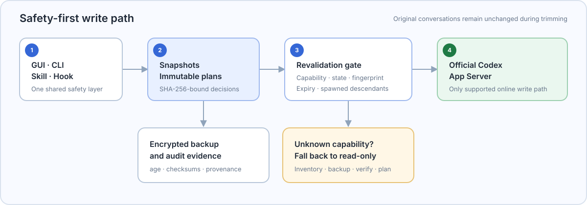
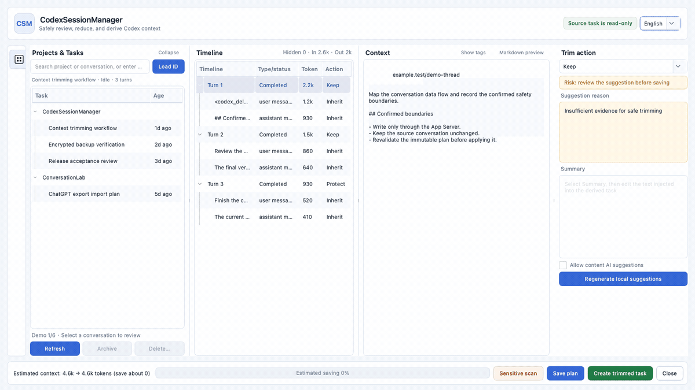

# CodexSessionManager

<p align="center">
  
</p>

<p align="center">
  <strong>A safety-first GUI and CLI for auditing, backing up, cleaning, importing, and planning Codex context projections.</strong><br>
  English · <a href="README-cn.md">简体中文</a> · <a href="docs/CodexSessionManager-GUI-Guide-bilingual.pptx">Bilingual GUI guide</a>
</p>

Long-running Codex work spreads conversations across projects and lets context grow unchecked. CodexSessionManager brings review, encrypted backup, guarded cleanup, and context projection planning into one auditable desktop tool.

<a id="features"></a>
## ✨ Key features

- Group and search Codex conversations by project, activity, source, and relationship.
- Create streaming, age-encrypted `.csmbackup` archives with full integrity verification.
- On the first GUI backup, generate one locally managed age identity and automatically reuse it for selected tasks and their complete derived closures.
- Plan archive and unarchive operations before execution; restore, import, and context projection currently produce plans without writing to Codex.
- Generate redacted App Server schema audits; version, binary, and full-schema hashes are diagnostics and plan-invalidation evidence, not archive authorization conditions.
- Create and review Keep/Exclude/Summary/Protect context projection plans; current plans are not applied to source or derived tasks.
- Review model-visible content, Markdown, hidden tags, dependencies, and estimated token savings.
- Scan locally for likely credentials and personal data with bounded background workers, cancellable modal progress, and highlighted matches.
- Use the GUI, CLI, explicit Codex Skill, or optional fail-open PreCompact/PostCompact Hooks.
- Run self-contained macOS arm64 and Windows x64 builds without installing Python, Qt, uv, or age.

### Safer defaults at a glance

| Need | Ad hoc workflow | CodexSessionManager |
| --- | --- | --- |
| Review many conversations | Search projects and raw history separately | Project-grouped inventory and timeline review |
| Clean old work | Delete or archive without a reproducible decision record | Backup first, then a dry-run plan, contract checks, descendant expansion, and App Server archive/unarchive |
| Review and project context | Rewrite history or accept all-or-nothing compaction | Create a fingerprint-bound projection plan; current execution is unavailable |
| Back up and migrate | Copy internal files and hope versions match | Encrypted logical records, checksums, provenance, verification, and new IDs on restore |

<a id="quick-start"></a>
## ⚙️ Quick start

> [!WARNING]
> `v1.0.0` is a **test prerelease**. The macOS build is ad-hoc signed and not notarized; the Windows build is unsigned. Verify the matching SHA-256 file before launch and do not treat either build as production-ready.

> [!NOTE]
> The current `main` source reports `1.1.0` as a first-delivery candidate, but no matching binary has been published. The links below still point to the released `v1.0.0` test build.

**Requirements**

- Release build: Apple Silicon macOS or Windows x64, plus a local Codex App/CLI installation for App Server access.
- Source build: [uv](https://docs.astral.sh/uv/) and Git. uv manages the pinned CPython 3.13.14 environment.

### 1. Download a test build

Download the archive and its `.sha256` file from the [`v1.0.0` test release](https://github.com/Aiyawoc/CodexSessionManager/releases/tag/v1.0.0):

- [macOS arm64 ZIP](https://github.com/Aiyawoc/CodexSessionManager/releases/download/v1.0.0/CodexSessionManager-macOS-arm64-1.0.0-test.zip) · [SHA-256](https://github.com/Aiyawoc/CodexSessionManager/releases/download/v1.0.0/CodexSessionManager-macOS-arm64-1.0.0-test.zip.sha256)
- [Windows x64 ZIP](https://github.com/Aiyawoc/CodexSessionManager/releases/download/v1.0.0/CodexSessionManager-Windows-x64-1.0.0-test.zip) · [SHA-256](https://github.com/Aiyawoc/CodexSessionManager/releases/download/v1.0.0/CodexSessionManager-Windows-x64-1.0.0-test.zip.sha256)

### 2. Verify and launch

macOS arm64:

```bash
shasum -a 256 -c CodexSessionManager-macOS-arm64-1.0.0-test.zip.sha256
ditto -x -k CodexSessionManager-macOS-arm64-1.0.0-test.zip .
"./CodexSessionManager.app/Contents/MacOS/CodexSessionManager" cli doctor
"./CodexSessionManager.app/Contents/MacOS/CodexSessionManager"
```

Windows x64 PowerShell:

```powershell
$Archive = ".\CodexSessionManager-Windows-x64-1.0.0-test.zip"
$Expected = ((Get-Content "$Archive.sha256").Trim() -split '\s+')[0]
$Actual = (Get-FileHash $Archive -Algorithm SHA256).Hash
if ($Actual.ToLower() -ne $Expected.ToLower()) { throw "SHA-256 mismatch" }
Expand-Archive $Archive -DestinationPath . -Force
PowerShell -NoProfile -ExecutionPolicy Bypass -File .\CodexSessionManager-Windows-x64\Install-CodexSessionManager.ps1
& "$env:LOCALAPPDATA\CodexSessionManager\CodexSessionManager.exe"
```

Or run the basic GUI and CLI directly from source:

```bash
uv sync --locked --compile-bytecode
uv run csm --help
uv run CodexSessionManager
```

Backup verification and a complete `doctor` check require both `age` and `age-keygen`. Platform builds fetch and verify both from the same pinned release; development environments may override them with `CSM_AGE_BIN` and `CSM_AGE_KEYGEN_BIN`.

### 3. Try the minimum GUI workflow

1. Search for a project/conversation, or enter a complete conversation ID.
2. Select a turn or item, then choose **Keep**, **Exclude**, **Summary**, or **Protect**.
3. Use **Save plan** to store the reviewed context projection plan without changing Codex; current execution against the source or a derived task is unavailable.
4. In Cleanup mode, adjust the final candidates and use **Backup** followed by **Archive**. On first use, confirm creation of the locally managed key; selecting only archived tasks switches the action to **Unarchive**, while mixed states are disabled. The app fully verifies the backup and rereads the contract, state, and descendant closure before writing.

### Build and release status

[](https://github.com/Aiyawoc/CodexSessionManager/actions/workflows/ci.yml)
[](https://github.com/Aiyawoc/CodexSessionManager/releases)


[](LICENSE)

> [!NOTE]
> The repository's code was generated entirely by ChatGPT. Human review, automated tests, and target-platform validation are still required; inspect the code independently before relying on write operations.

<a id="contents"></a>
## Contents

- [✨ Key features](#features)
- [⚙️ Quick start](#quick-start)
- [📌 Use cases](#use-cases)
- [Safety model](#safety-model)
- [📖 Documentation](#documentation)
- [🔧 Configuration](#configuration)
- [Development, testing, and packaging](#development)
- [❓ FAQ](#faq)
- [🤝 Contributing](#contributing)
- [📄 License](#license)

<a id="use-cases"></a>
## 📌 Use cases

| Scenario | What CSM provides |
| --- | --- |
| Many long-running Codex projects | One project-grouped list with conversation search, relative activity, multi-selection, and relationship tracking |
| Context approaching compaction | Review and save a projection plan, or use an optional PreCompact prompt before native compaction proceeds |
| Old or inactive conversations | Rule-based candidates, dry-run archive plans, batch limits, and human confirmation |
| Backup or account migration | Encrypted CSM backups, logical restore, Codex rollout import, and ChatGPT export branch expansion |
| Sensitive-data review | Bounded background scanning, cancellable progress, and red highlighting without uploading conversation content |
| Auditable maintenance | Immutable plan hashes, source fingerprints, capability checks, and a CSM-owned audit chain |

The primary audience is developers and maintainers who use Codex across multiple repositories, keep long-lived conversations, or need a reviewable alternative to manipulating Codex's internal storage.

<a id="safety-model"></a>
## Safety model



- Online Codex reads and writes use the official App Server. CSM does not rewrite Codex JSONL or SQLite.
- The boundary is version-independent and contract-sensitive: archive and unarchive are evaluated against static, human-reviewed minimal operation contracts.
- The current Codex version, binary hash, and full schema hash are diagnostic and plan-invalidation evidence, not archive authorization conditions.
- Unrelated changes are automatically compatible; incompatible related methods, fields, or critical enums disable only the affected operation and report the precise reason.
- Every write consumes a SHA-256-bound plan and re-checks state, content fingerprints, capabilities, expiry, and spawned descendants.
- The first-version task-management write surface is batch archive and unarchive only; permanent deletion, rename, restore/import writes, context application, and MCP writes are unavailable.
- Context review and projection planning do not modify Codex. Source-task application is unavailable, and derived projection remains blocked until a complete real round-trip probe passes.
- Tool calls/results and file changes/verifications are retained or summarized as groups, not split into unsafe fragments.
- Hook failures are fail-open: timeout, close, crash, or launch failure continues native compaction.

<a id="documentation"></a>
## 📖 Documentation

### Stable user installation

Launching the extracted macOS App directly does not install the Skill or CLI launcher. From a checkout matching the release tag, install it into the stable user path with:

```bash
scripts/install_user.sh /absolute/path/to/CodexSessionManager.app
~/.local/bin/csm doctor
```

The installer atomically replaces `~/Applications/CodexSessionManager.app`, retains the previous App for rollback, creates `~/.local/bin/csm`, and links the bundled Skill. The Windows installer shown in Quick start provides the equivalent user-level installation under `%LOCALAPPDATA%\CodexSessionManager`. Neither installer enables Hooks automatically.

### GUI workflow

Launching CodexSessionManager opens the existing Projects & Tasks, Timeline, Context, and Actions review GUI. Context review and projection planning keep using this complete interface. A cleanup request injects the LLM/Skill shortlist without preselecting it and lists locally safe roots that the user may explicitly add. The table-header select-all applies only to the current filter; Backup and Archive are separate steps, and selecting only archived tasks switches the action to Unarchive while mixed states are disabled. The second button in the left rail switches the same window into Memory Management mode. It loads only explicitly registered UTF-8 Markdown/text files, segments them structurally, supports Keep/Delete/Replace/Protect, shows the complete diff, creates a private version, rechecks concurrent drift, atomically replaces the file, and rereads it for verification. Pending Plans and Backup & Restore remain auxiliary entries rather than replacing the primary review GUI.

<p align="center">
  
</p>
<p align="center"><sub>12-second deterministic demo · fictional IDs, paths, repository, and conversation content</sub></p>

1. **Projects & Tasks** groups conversations by project cwd or Git remote. Search and complete-ID loading share one field; multi-selection supports guarded batch actions.
2. **Timeline** shows model-visible turns/items and hides empty internal events by default. Token totals use compact units.
3. **Context** is editable when source mapping is complete and supports hidden-tag display, segmented source rendering, Markdown preview, and local sensitive-range highlighting. Incomplete mapping still loads the timeline and source for read-only review but cannot create a projection plan.
4. **Projection actions** support `keep`, `exclude`, `summary`, or `protect`. Hard-protected requests, active turns, goals, unresolved errors, and unknown items cannot be silently removed; these actions currently produce plans only.
5. **Cleanup supplementation** distinguishes LLM suggestions from current local safe roots; the user always confirms the final selection, and both are rechecked against the complete descendant closure before planning and backup.
6. **External suggestion injection** only accepts locally rebound conversation, turn, or item IDs with current fingerprints; hard protection and `validate_selections` retain final veto power.
7. **Memory Management** uses the second left-rail button and the same window shell. Only registered sources are visible. LLM suggestions are rebound to current segment IDs and content SHA-256 values; headings, front matter, fenced code, and structural whitespace retain local hard protection. Confirmed writes create a version before atomic replacement and reread verification.
8. **Backup and archive** are separate steps. The GUI uses one native age identity generated on first use in the app's private data directory, derives its recipient automatically, and reuses it for full decryption verification. Before archive or unarchive, it rereads the contract, state, fingerprints, and complete descendant closure. The CLI retains its explicit `--recipient`/`--identity` workflow.

Saving a plan only persists the reviewed `TrimPlan`; it does not write to Codex. The current baseline does not treat “create trimmed task” as an available capability; `thread/inject_items` can be reconsidered only after a complete real round-trip probe passes.

Current context capability boundary:

- Context review/projection planning: available.
- Apply to the source task: unavailable.
- Derived projection: current real round-trip failed; blocked.
- Deterministic sensitive-data edits: next priority.
- First-version task-management writes: batch archive and unarchive only; permanent deletion, rename, restore/import writes, and context application are unavailable.

### CLI workflows

```bash
csm doctor
csm schema audit --output schema-audit-v1.json
csm threads list
csm threads list --older-than-days 90
csm threads show CONVERSATION_ID --include-content
csm gui open --page pending
csm trim review CONVERSATION_ID
csm memory sources
csm memory review SOURCE_ID
csm acceptance run --output acceptance-first-delivery.json
csm audit show
```

You can generate non-executing cleanup suggestions before entering the plan-and-backup workflow:

```bash
csm cleanup review --older-than-days 90
csm backup create backup.csmbackup \
  --thread CONVERSATION_ID \
  --recipient age1... \
  --identity /secure/path/identity.txt
csm cleanup plan --action archive --older-than-days 90
csm cleanup apply PLAN.json --confirm PLAN_ID
```

Important command groups:

`csm threads list` reads all visible active and archived tasks through the official App Server by default, then CSM performs search, project, and time filtering itself. `--older-than-days N` computes a UTC cutoff from `updated_at` and returns only tasks not updated within N days. The GUI context-review page's “Filter days > N days” control uses the same tool-side logic; `0` means all. The LLM does not manually read or filter the task data. `csm cleanup review --older-than-days N` remains a separate sealed cleanup-candidate workflow.

| Command | Purpose |
| --- | --- |
| `csm threads list\|show` | Read-only inventory and content inspection |
| `csm schema audit` | Write a versioned protocol-difference report without private paths or conversation content |
| `csm acceptance report` | Record fixed stages, hashed task IDs, and evidence hashes; always non-production |
| `csm backup create\|verify` | Streaming age-encrypted backup and full verification |
| `csm cleanup review` | Create sealed cleanup suggestions and inject them into the original task GUI for final user selection |
| `csm cleanup plan\|apply` | Plan-based archive/unarchive workflow |
| `csm restore plan` | Create a logical restore plan; it does not write to Codex |
| `csm import {chatgpt\|codex} plan ...` | Create an import plan; it does not write to Codex |
| `csm trim review\|suggest` | GUI/manual review and local projection suggestions |
| `csm memory ...` | Register, segment, review, diff, version, atomically edit, and restore local memory files |
| `csm gui open` | Open an original-GUI review mode or sealed request; pending/backup use auxiliary entries |
| `csm acceptance run\|release` | Run isolated first-delivery checks; release also requires age and the stable installed app |
| `csm hook install\|status\|uninstall` | Optional PreCompact/PostCompact integration |
| `csm audit show\|verify` | Inspect and verify the CSM audit chain |

The current baseline does not run or accept `csm trim apply` as an available write workflow; an `{}` response, a created target, or method presence does not prove projection persistence.

Passphrase mode reads the secret directly from the terminal. Do not place backup passphrases in command arguments, environment variables, logs, issues, or model context. GUI and unattended workflows use age recipients instead.

### Codex Skill

The stable installers place `manage-codex-sessions` under `~/.agents/skills`. Restart Codex, then invoke it explicitly:

```text
$manage-codex-sessions open context review and projection planning for this conversation
```

The Skill does not run automatically during ordinary coding work. It resolves the stable `csm` launcher or bundled executable and follows the same plan and safety gates as the GUI and CLI.

### Codex desktop local MCP

CSM provides a read-only orchestration MCP server over stdio for Codex desktop/CLI. Add
it to the Codex `config.toml` so Codex starts the stable launcher itself:

```toml
[mcp_servers.codex_session_manager]
command = "/Users/test-user/.local/bin/csm"
args = ["mcp", "stdio"]
```

The test kit's `configure-codex-mcp.sh` adds the actual absolute paths and binds
`CODEX_HOME` plus the CSM private directories to the same isolated test environment.
After configuring, restart Codex desktop and check Settings → MCP servers or `/mcp` in
the composer. The stdio path does not require HTTPS, a public endpoint, a Bearer token,
or an OpenAI Secure MCP Tunnel.

The server only inspects bounded metadata, prepares structured suggestions, opens the
local human-review GUI, and reports review status. It never exposes archive/unarchive
executors, permanent deletion, trim application, or memory-write executors.

For a separate HTTP compatibility diagnostic, keep a long random Bearer token in the
local environment and bind only to loopback:

```bash
export CSM_MCP_BEARER_TOKEN='a-long-random-value-generated-locally'
csm mcp serve --host 127.0.0.1 --port 8765 --path /mcp
```

The health endpoint is `/healthz` and the MCP endpoint is `/mcp`. `--allow-unauthenticated-local`
is only for explicit loopback testing and must not be used for a public service. The
desktop app's `CSM_MCP_AUTO_START=1` is an optional HTTP diagnostic switch; Codex desktop
starts `csm mcp stdio` itself for the local MCP path.

Registered tools:

```text
inspect_conversation_inventory
prepare_cleanup_suggestions
open_cleanup_review
prepare_context_suggestions
open_context_review
inspect_memory_source
prepare_memory_suggestions
open_memory_review
get_pending_review_status
open_review_demo
```

Every suggestion and review request still requires final confirmation in the original GUI. Memory tools accept only registered source IDs, never arbitrary filesystem paths, and expose no write executor. Codex desktop local MCP, real Cocoa GUI behavior, account integration, and installed-app testing remain separate target-machine acceptance steps.

### Optional Hooks

```bash
csm hook status
csm hook install --yes
csm hook uninstall --yes
```

Installation does not silently enable Hooks. After installation, review and trust the exact command in Codex `/hooks`. PreCompact shows a lightweight prompt; it is fail-open by default and returns `continue: false` only after a plan is safely persisted, the user explicitly chooses strict review, and all current capability/fingerprint gates pass. It never creates a derived task inside the active turn.

### Further reading

- [Bilingual GUI guide (PPTX)](docs/CodexSessionManager-GUI-Guide-bilingual.pptx)
- [Skill command workflows](skills/manage-codex-sessions/references/commands.md)
- [Skill safety invariants](skills/manage-codex-sessions/references/safety.md)
- [Domain language and relationships](CONTEXT.md)
- [Architecture decision records](docs/adr/)
- [v1.1 context projection and sensitive-data plan](docs/CodexSessionManager-v1.1-context-projection-and-sensitive-data-plan.md)
- [ADR 0009: defer context projection application](docs/adr/0009-defer-context-projection-application.md)
- [ADR 0011: version-independent operation contracts](docs/adr/0011-version-independent-operation-contracts.md)
- [v1.1 acceptance index](docs/acceptance/README.md)
- [Final phase-two implementation plan (v1.2.0—v1.5.0)](docs/CodexSessionManager%20二期最终实施计划.md)
- [Human App Server schema approval process](docs/acceptance/app-server-schema-approval.md)
- [`v1.1.0` first-delivery acceptance runbook](docs/acceptance/first-delivery-v1.1.0.md)
- [`v1.1.0` local two-step controlled acceptance plan](docs/acceptance/local-controlled-v1.1.0.md)
- [`v1.1.0` pre-release manual acceptance runbook](docs/acceptance/formal-release-manual-v1.1.0.md)
- [`v1.1.0` first-delivery candidate notes](docs/releases/v1.1.0-first-delivery.md)
- [`v1.0.1` macOS real-account acceptance runbook](docs/acceptance/macos-real-account-v1.0.1.md)
- [`v1.0.1` hardening-candidate notes](docs/releases/v1.0.1-test.md)
- [`v1.0.0` test-release notes](docs/releases/v1.0.0-test.md)
- [Project development constraints](AGENTS.md)

<a id="configuration"></a>
## 🔧 Configuration

CSM uses platform-native user directories by default. Environment variables are intended for explicit account selection, isolated tests, or advanced installations.

| Variable | Purpose |
| --- | --- |
| `CSM_CODEX_HOME` | Explicit Codex data root used by CSM |
| `CODEX_HOME` | Codex's official data-root override; if both home variables are set, they must resolve to the same path |
| `CSM_CODEX_BIN` | Absolute path or command name for the Codex CLI/App Server launcher |
| `CODEX_CLI_PATH` | Optional executable Codex CLI path for desktop launches |
| `CSM_APP_PATH` | Stable installed App root or executable used when generating Hook commands |
| `CSM_DATA_DIR` | Plans, imports, backups, and audit database root |
| `CSM_CONFIG_DIR` | CSM configuration root |
| `CSM_CACHE_DIR` | Cache root |
| `CSM_LOG_DIR` | Application and Hook log root |
| `CSM_AGE_BIN` | Development-only age executable override; standalone builds use their verified bundled binary |
| `CSM_AGE_KEYGEN_BIN` | Development-only age-keygen executable override; standalone builds use their verified bundled binary |

If `CSM_CODEX_HOME` and `CODEX_HOME` point to different roots, every entry point refuses to continue. This prevents one account's task state from being combined with another account's plans or audit evidence.

Stable installation paths are `~/Applications/CodexSessionManager.app` on macOS and `%LOCALAPPDATA%\CodexSessionManager` on Windows. Hooks must target these stable locations, never a source checkout or `.venv`.

<a id="development"></a>
## Development, testing, and packaging

### Development setup

```bash
git clone https://github.com/Aiyawoc/CodexSessionManager.git
cd CodexSessionManager
uv sync --locked --compile-bytecode
scripts/check.sh
```

`scripts/check.sh` verifies generated Qt files, Ruff formatting/lint, strict mypy, offscreen PySide6 tests, and the Skill contract. More focused workflows are available for source, installation, Skill, Hook, and lifecycle checks:

```bash
scripts/test_source_workflow.sh
scripts/test_install_workflow.sh dist/CodexSessionManager.app
scripts/test_skill_workflow.sh dist/CodexSessionManager.app
scripts/test_hook_workflow.sh dist/CodexSessionManager.app
scripts/test_full_workflow.sh
```

These checks use isolated temporary data. They do not replace real-account App Server testing, physical-device UI testing, signing/notarization, SmartScreen reputation, or production acceptance.

The `CI` workflow runs the complete source workflow on `macos-15` after asserting `arm64`, while retaining Windows checks. The manual `build-macos` workflow always invokes `scripts/test_full_workflow.sh` from current source and never uses `--reuse-app`; hosted runners do not assume Codex is installed, so only the in-bundle App Server connectivity check is skipped there and this is not real-account acceptance.

To test a macOS App against a copy of the current Codex home:

```bash
scripts/install_test_app.sh
scripts/launch_test_app.sh /absolute/path/printed/as/TEST_ROOT
```

The copied test root may contain authentication data. Close Codex before copying when possible, and remove only the exact `TEST_ROOT` printed by the installer.

### Desktop packaging

macOS arm64, on real Apple Silicon hardware:

```bash
scripts/build_macos_app.sh
scripts/accept_macos_bundle.sh dist/CodexSessionManager.app
TEST_HOME=/private/tmp/csm-first-delivery-home
mkdir -m 700 -p "$TEST_HOME"
HOME="$TEST_HOME" CSM_INSTALL_SKIP_APP_SERVER=1 \
  scripts/install_user.sh "$PWD/dist/CodexSessionManager.app"
HOME="$TEST_HOME" scripts/accept_first_delivery.sh \
  --evidence-dir build/first-delivery-bundle-$(date +%Y%m%d-%H%M%S) \
  --app dist/CodexSessionManager.app \
  --stable-app "$TEST_HOME/Applications/CodexSessionManager.app"
scripts/package_macos_release.sh --app dist/CodexSessionManager.app
```

The final script validates the source `.app`, creates a ZIP and `.sha256`, extracts it into a clean temporary directory, and validates the extracted bundle again without overwriting existing artifacts. Test-channel filenames include `-test`; public release still requires Developer ID signing, notarization, and stapling.

Windows x64, on Windows AMD64 or the manual GitHub Actions workflow:

```powershell
.\scripts\check_windows.ps1
.\scripts\build_windows_app.ps1 -Version 1.1.0
```

Both builds use `pyside6-deploy` / Nuitka standalone mode and include pinned Python, Qt, plugins, application dependencies, and verified `age`/`age-keygen` executables. Formal public distribution still requires Developer ID signing/notarization/stapling on macOS and an appropriate Authenticode signature on Windows.

<a id="faq"></a>
## ❓ FAQ

<details>
<summary><strong>Does CSM modify Codex's JSONL or SQLite files?</strong></summary>

No. Online reads and writes use the App Server. Raw rollout data may be retained inside an encrypted disaster-recovery backup, but CSM does not treat direct internal-file editing as a supported restore or trimming API.
</details>

<details>
<summary><strong>Do end users need Python, uv, Qt, or age?</strong></summary>

No for standalone builds. The macOS and Windows bundles carry their own runtime and verified `age`/`age-keygen` executables. Source development requires uv; uv obtains the pinned Python version without changing the system Python.
</details>

<details>
<summary><strong>Why does Gatekeeper or SmartScreen warn about the download?</strong></summary>

`v1.0.0` is explicitly a test release. macOS is ad-hoc signed and not notarized; Windows has no Authenticode signature or SmartScreen reputation. Verify the published checksum and source before evaluating it. Do not bypass a warning for an unverified file.
</details>

<details>
<summary><strong>Why is the conversation list empty or App Server unavailable?</strong></summary>

Run `csm doctor`. Codex CLI discovery order is `CSM_CODEX_BIN`, a valid `CODEX_CLI_PATH`, ChatGPT.app's bundled Codex, PATH's `codex`, and finally the literal `codex` fallback. Also verify that `CODEX_HOME` and `CSM_CODEX_HOME` refer to the intended, identical data root.
</details>

<details>
<summary><strong>Can the current baseline apply a projection to a Codex task?</strong></summary>

**Save plan** only writes a reviewed immutable projection plan to CSM's data directory. It cannot currently be applied to the source task; derived projection failed its real round-trip, so a “created trimmed task” is not an accepted result.
</details>

<details>
<summary><strong>Can CSM permanently delete conversations?</strong></summary>

Permanent deletion is not provided in the current release: there is no eligibility inspection, plan, GUI, CLI, Skill, MCP, or executor. Historical partial-commit evidence is retained only for traceability; an upstream delete method does not authorize a CSM capability.
</details>

<details>
<summary><strong>Does sensitive scan prove that a secret is valid or leaked?</strong></summary>

No. It uses deterministic local patterns and checksum validation where applicable. It can produce false positives and miss unusual formats; it is a review aid, not a credential-validation service.
</details>

<details>
<summary><strong>Can I merge conversations from another account?</strong></summary>

CSM can plan logical imports from CSM backups, Codex rollout data, and official ChatGPT exports. Imported conversations receive new IDs, keep source provenance, and never replay tool calls. Uncertain project mappings remain quarantined for review.
</details>

<details>
<summary><strong>Which platforms are currently released?</strong></summary>

The test release covers macOS arm64 and Windows x64. There is no released Intel macOS or Linux build. Target-platform acceptance must be performed on the corresponding real platform or hosted Windows runner.
</details>

<a id="contributing"></a>
## 🤝 Contributing

Focused issues and pull requests are welcome.

1. Describe the problem, expected behavior, reproduction scope, and platform without attaching credentials or real conversation data.
2. Add or update tests for behavior changes; keep GUI, CLI, Skill, and Hook entry points on the shared plan/safety layer.
3. Run `scripts/check.sh` and the relevant focused workflow before opening a pull request.
4. Update both README files when user-visible commands, platform support, or safety behavior changes.

Read [AGENTS.md](AGENTS.md) before making implementation changes. Do not add direct Codex JSONL/SQLite writes, implicit network installation in Hooks, or write paths that bypass immutable plans.

The current project code was generated entirely by ChatGPT, but generated code is not self-validating. Contributions of any origin still require human review, reproducible tests, and honest target-environment evidence.

<a id="license"></a>
## 📄 License

CodexSessionManager is released under the [MIT License](LICENSE). Bundled dependencies and tools retain their own licenses; see [THIRD_PARTY_NOTICES.md](THIRD_PARTY_NOTICES.md).

⭐ If this project is useful to you, consider giving it a Star. Continued maintenance and iteration are planned.

## 🗺️ Memory-file management status

The first-delivery implementation now includes explicit source registration, path/symlink boundaries, UTF-8 Markdown/text segmentation, stable segment IDs, `KEEP/DELETE/REPLACE/PROTECT`, LLM suggestion fingerprint binding, final confirmation in the original GUI, unified diff, private versions, concurrent-drift detection, atomic writes, reread verification, audit, and plan-based restore. It does not manage ChatGPT account-side Memory.

Future enhancements include full-text search, richer Markdown semantics, optionally encrypted memory versions, multi-file plans, and focused UI acceptance in a real Windows bundle.
