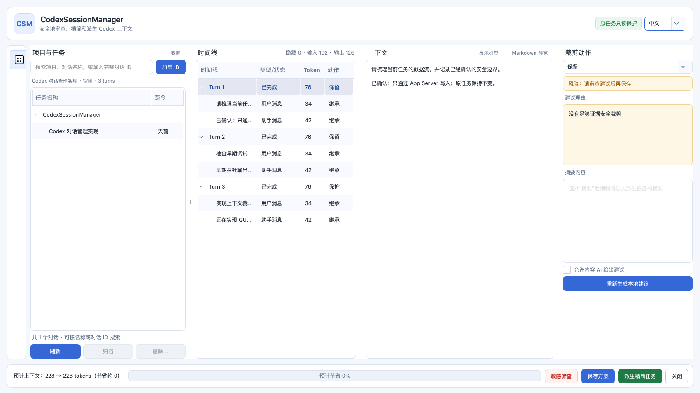

# CodexSessionManager

[中文 README](README-cn.md) | English

<p align="center">
  
</p>
<p align="center">
  <sub>
    Review projects, conversations, timeline items, context, and trimming actions in one workspace. ·
    <a href="docs/CodexSessionManager-GUI-Guide-bilingual.pptx">Bilingual GUI guide (PPTX)</a>
  </sub>
</p>

> **Why this project?** Long-running Codex work accumulates conversations and context across many projects, making safe review, backup, cleanup, and context reduction increasingly difficult. CodexSessionManager brings those workflows into one auditable interface while keeping source tasks read-only and avoiding direct edits to Codex's internal storage.

> **Code-generation disclosure:** The code in this project was generated entirely by ChatGPT. It has received human review, testing, and release decisions; verify it independently before production use.

> **Test-release notice:** `v1.0.0` is a prerelease for isolated testing. The macOS arm64 asset is ad-hoc signed and not notarized; the Windows x64 asset is unsigned. Expect Gatekeeper or SmartScreen warnings, verify the published SHA-256 files, and do not treat either asset as a production build.

CodexSessionManager (`csm`) is a safety-oriented management tool for Codex App tasks. It includes a CLI, a PySide6 context-trimming GUI, an explicitly invoked Skill, optional PreCompact/PostCompact Hooks, and self-contained macOS and Windows bundles with Python, Qt, and age.

Online reads and writes go through the official Codex App Server only; the program never directly rewrites Codex JSONL or SQLite. Context trimming always creates a derived task and leaves the original task unchanged. Any archive, restore, import, trim, or permanent purge operation must consume an immutable SHA-256-bound plan and re-check protocol capabilities, content fingerprints, state, and descendant closure before execution.

---

## Contents

- [Quick start](#quick-start)
  - [Install and launch the GUI](#install-and-launch-the-gui)
  - [Trim context in the GUI](#trim-context-in-the-gui)
  - [Install an isolated test copy](#install-an-isolated-test-copy)
- [Development environment](#development-environment)
- [Daily use](#daily-use)
- [Safety workflow](#safety-workflow)
- [Context trimming](#context-trimming)
- [Hooks](#hooks)
- [Automated test workflow](#automated-test-workflow)
- [Desktop builds and test releases](#desktop-builds-and-test-releases)
- [Project structure](#project-structure)

## Quick start

| Entry point | Best for | Notes |
| --- | --- | --- |
| macOS `CodexSessionManager.app` | Daily review and trimming on Apple Silicon | The standalone bundle includes Python, Qt, plugins, and age |
| Windows `CodexSessionManager.exe` | Daily review and trimming on Windows x64 | Extract the test ZIP and run the bundled user installer |
| `$manage-codex-sessions` in Codex | Open the GUI from Codex or run a guarded workflow | Restart Codex after installation; the Skill prefers `csm` and can fall back to the stable in-App executable |
| `~/.local/bin/csm` | CLI, backups, plans, and audit | The user-level launcher runs CLI subcommands only |
| `scripts/launch_test_app.sh` | Isolated GUI testing | Launches against a copied Codex home instead of the real user directory |

### Install and launch the GUI

Download both test builds and their `.sha256` files from the [`v1.0.0` prerelease](https://github.com/Aiyawoc/CodexSessionManager/releases/tag/v1.0.0), then verify the asset before opening it.

On macOS arm64, a locally built App can be installed and launched with:

```bash
scripts/install_user.sh dist/CodexSessionManager.app
"$HOME/Applications/CodexSessionManager.app/Contents/MacOS/CodexSessionManager"
```

The installer uses a user-owned directory and an atomic replacement, so administrator access is not required. It also links the bundled Skill into `~/.agents/skills/manage-codex-sessions`; restart Codex if `$manage-codex-sessions` does not appear immediately. The downloadable test asset is ad-hoc signed but not notarized, so macOS may quarantine it. Remove quarantine only after checking the SHA-256 and confirming that the asset came from this repository; a formal distribution must instead use Developer ID signing and notarization.

On Windows x64, extract the ZIP, inspect the bundled installer, and run it from PowerShell:

```powershell
Get-FileHash .\CodexSessionManager-Windows-x64-1.0.0-test.zip -Algorithm SHA256
PowerShell -NoProfile -ExecutionPolicy Bypass -File .\CodexSessionManager-Windows-x64\Install-CodexSessionManager.ps1
& "$env:LOCALAPPDATA\CodexSessionManager\CodexSessionManager.exe"
```

The Windows installer uses `%LOCALAPPDATA%\CodexSessionManager`, retains the previous installation for rollback, installs the bundled Skill under `~/.agents/skills`, and adds the stable application directory to the user `PATH`. Because the test executable has no Authenticode signature, Windows may show SmartScreen warnings. Hook installation remains a separate, explicit action on both platforms.

After restarting Codex, invoke `$manage-codex-sessions` and ask it to open context trimming for a conversation. The Skill resolves `csm` first, then the platform's stable bundled executable. Automatic PreCompact review remains disabled until the user separately runs `csm hook install --yes` and reviews/trusts the definition in Codex `/hooks`.

After launch, the **Projects & Tasks** pane groups conversation names and relative activity times by project:

1. Use the shared field to search projects/conversations, or enter a full conversation ID and click **Load ID**.
2. Select a turn/item in the timeline and inspect its content and protection reasons.
3. Choose **Keep / Exclude / Summary / Protect** in the action pane and edit a summary when needed.
4. Click **Save plan** to persist the reviewed, immutable TrimPlan without changing any conversation, or click **Create trimmed task** to save and apply it to a new derived task. The original task remains read-only.

The language selector to the right of the read-only badge switches the live interface between Simplified Chinese (default) and English. The **Collapse** control beside the project/task title hides the left pane. Click the project/task icon in the fixed rail to restore it. Each divider keeps an 8px draggable hit area with a centered 1px blue-gray line, so the timeline and source panes can be resized without changing the action pane width.

### Trim context in the GUI

The GUI operates at turn level by default; item-level selection is available for advanced review. The current request, in-progress turns, valid goals, unresolved errors, unknown items, and grouped tool-call/result and file-change/verification records are hard-protected. Estimated tokens and savings appear in the footer; resolve risk warnings before applying a plan.

**Sensitive scan** uses deterministic local rules on model-visible text and does not upload content. It detects private-key headers, common cloud/API keys, JWTs, password or token assignments, email addresses, and Mainland China phone numbers, plus checksum-validated Chinese resident IDs and payment-card numbers. Placeholders, redacted values, and invalid numbers are ignored. When enabled, the task list shows only likely matches and the **Context** pane marks matched ranges as white text on red. This is review assistance and can still produce false positives or miss unusual secret formats.

### Install an isolated test copy

The test installer copies the current Codex home, creates an isolated `HOME`, data, config, cache, and log directory, and installs a standalone App:

```bash
scripts/install_test_app.sh
```

At completion it prints `TEST_ROOT`, `APP`, `LAUNCHER`, `SKILL`, and a generated `LAUNCH_SCRIPT`. Run the generated script to open the isolated GUI:

```bash
"/private/tmp/csm-codex-home-test.xxxxxx/launch-test-app.sh"
```

Or use the reusable repository launcher:

```bash
scripts/launch_test_app.sh "/private/tmp/csm-codex-home-test.xxxxxx"
```

The test install skips the external App Server probe by default so the bundled runtime can be checked on a minimal `PATH`. `doctor --skip-app-server` verifies the embedded Python, PySide6, Qt plugins, age, signature, and writable directories. The copy skips Unix sockets and other runtime special files, but it may contain authentication data; after testing, delete only the exact `TEST_ROOT` printed by the installer.

## Development environment

The project is pinned to CPython 3.13.14. It does not use `/usr/bin/python3` or install dependencies into the system Python. uv obtains and manages the required Python in an isolated project environment:

```bash
uv sync --locked --compile-bytecode
uv run csm doctor
scripts/check.sh
```

Dependencies are grouped as `runtime`, `gui`, `dev`, and `build` and locked in `uv.lock`. Hooks and Skills never run `uv sync`, download Python, or install dependencies at trigger time.
Packaging uses a separate `build/.venv-build` environment and syncs only `runtime + gui + build`; keeping it separate also prevents Qt deployment scanners from treating the packaging environment as application QML resources.

## Daily use

From a source checkout:

```bash
uv run csm --help
uv run csm threads list
uv run csm threads show THREAD_ID --include-content
uv run csm cleanup plan --older-than-days 90
uv run csm trim review THREAD_ID
```

Each installed application has one distribution entry point:

```text
CodexSessionManager                  open the GUI
CodexSessionManager cli ...          run the CLI
CodexSessionManager hook precompact  run the Hook protocol
```

User-level installation does not require administrator privileges:

```bash
scripts/install_user.sh dist/CodexSessionManager.app
~/.local/bin/csm doctor
```

The installer performs an atomic replacement and keeps the previous version for rollback. Stable paths are `~/Applications/CodexSessionManager.app` on macOS and `%LOCALAPPDATA%\CodexSessionManager` on Windows; Hooks never reference the source checkout or `.venv`.

To test against a copy of the current `~/.codex`, use the isolated test installer. It creates separate `HOME`, `codex-home`, data, and log directories under the system temporary directory and does not overwrite the real user installation:

```bash
scripts/install_test_app.sh
```

The script prints the test directory and launch command when it finishes. It can also start the isolated GUI automatically:

```bash
CSM_OPEN_TEST_APP=1 scripts/install_test_app.sh
```

The installer also creates `TEST_ROOT/launch-test-app.sh` for repeated launches of the same test copy. The reusable launcher is `scripts/launch_test_app.sh TEST_ROOT`.

The installer automatically detects the host `codex` CLI and writes its path plus the Node runtime directory into the test launcher, allowing the GUI to load existing tasks through the isolated `CODEX_HOME`. If the CLI is not on `PATH`, set `CSM_CODEX_BIN=/absolute/path/to/codex` before installing. Without a CLI the GUI can still start, but its task list cannot be loaded through App Server.

To launch the test GUI manually, use the printed `EXECUTABLE` and environment variables to run the binary inside the bundle directly; do not use `open App.app`, because LaunchServices does not guarantee that the shell's `CODEX_HOME` is inherited.

Set `CSM_SOURCE_CODEX_HOME` to choose the copy source, or pass a second argument for a test root that must not already exist. The test root contains a copy of the Codex home and may contain authentication data, so remove that exact directory after testing.
The copy skips Unix sockets, FIFOs, devices, and other runtime special files. Exit Codex before copying when possible so the SQLite main database and WAL files form a more consistent snapshot.
Installation skips the external Codex App Server probe by default so the bundled runtime can be tested with no `codex`, uv, or Python on `PATH`. When a CLI is available, the installer records it and reuses the path in the generated launcher and CLI example.

## Safety workflow

A typical archive workflow is:

```bash
csm backup create backup.csmbackup \
  --thread THREAD_ID \
  --recipient age1... \
  --identity /secure/path/identity.txt
csm cleanup plan --action archive --older-than-days 90
csm cleanup apply PLAN.json --confirm PLAN_ID
```

- Tasks inactive for 90 days are candidates by default; one batch contains at most 100 root tasks.
- Automatic operations are capped at archiving. Permanent purge always requires a human-created plan, the exact plan ID, and a permanent confirmation phrase.
- Parent operations expand spawned descendants. Active, pinned, ephemeral, or incompletely read tasks are excluded from write plans.
- `parent_id` and `forked_from_id` are expanded as independent graph edges. Missing parents, cycles, or overlapping root closures stop writes.
- A task can become a manual purge candidate only after at least 14 days of archive evidence, a trusted CSM archive time, and a verified encrypted backup. Archive evidence is bound to the exact backup manifest used at the time and verified through the audit hash chain; the time credential is conservatively invalidated before unarchiving.
- Before permanently deleting each root task, the executor re-reads archive state, the 14-day gate, backup evidence, loaded state, background terminals, and local processes.
- After a write timeout, query actual state first; never blindly retry.
- Writes are enabled only for an audited Codex version plus a complete App Server schema SHA-256 pair. Unknown protocols or unstable mappings degrade to read-only, backup, and planning. The current write allowlist is the measured schema for Codex 0.142.1.

`.csmbackup` streams a tar archive directly into age, with the manifest at the end of the stream. Creation uses only an encrypted temporary destination and publishes it atomically without overwriting an existing file. Verification fully decrypts the package, recomputes `backup_fingerprint` from each embedded `ThreadSnapshot`, and compares it with the logical source and manifest without creating a plaintext container. Restore performs a second decryption pass and requires every verified member to appear again. Only this full-package verification can be recorded in the audit chain and serve as archive/purge evidence. In passphrase mode age reads the passphrase directly from the terminal; the GUI and automated tasks accept recipient-key mode only.

If `CSM_CODEX_HOME` and external `CODEX_HOME` are both set, they must resolve to the same data root. Otherwise every entry point, including Hook management commands, refuses to continue so tasks from one account cannot be mixed with backup or Hook state from another.

Restore and cross-account import create new conversation IDs. Supported sources include:

- logical restore from a CSM encrypted backup;
- root-to-leaf branch expansion from an official ChatGPT export;
- Codex rollout JSONL files or directories from another account;
- exact duplicates skipped, complete existing prefixes skipped, more complete sources preferred, and forks kept separately;
- unconfirmed project mappings imported into a CSM quarantine area; tool calls retain lazy provenance only and are never executed or replayed.

## Context trimming

```bash
csm trim suggest THREAD_ID
csm trim review THREAD_ID
csm trim apply PLAN.json --confirm PLAN_ID
```

Actions are `keep`, `exclude`, `summary`, and `protect`. The current request, in-progress turns, valid goals, approval decisions, unresolved errors, unknown items, and associated tool call/result and file-change/verification groups are hard-protected. The GUI operates at turn level by default, with item-level controls in the advanced view; scans, App Server requests, and analysis run in worker threads.

The GUI's left pane groups conversation names and relative activity times by project cwd or Git remote, without spending a separate column on status; status remains available in tooltips. Search and manual conversation-ID loading share one field. The list supports multi-selection plus context-menu rename, copy-conversation-ID, archive, and permanent-delete actions. Archive and delete still pass immutable-plan, descendant-closure, backup, state, and audit gates; permanent deletion also requires 14 days of trusted archive history and two explicit confirmations.

The **Sensitive scan** button at the lower right scans conversations one by one in a worker thread using local rules for likely keys, tokens, private keys, email addresses, phone numbers, identity numbers, and payment cards. Results retain categories and counts only—never the matched sensitive value—and no conversation content is uploaded to an external service. This is a potentially noisy local screening aid; it does not prove that a credential is valid or has been leaked.

The collapse icon beside the project/task title hides the pane. Its freed width is distributed between the timeline and source panes, while the rightmost trim-action pane keeps its width.

A fixed-width project/task entry remains at the far left; unfinished backup, cleanup, and audit placeholder icons are not shown. When the project/task pane is collapsed, that icon still restores it. The timeline table stretches its first column to the remaining width, and all three vertical dividers are draggable with a centered 1px blue-gray line.

When supported by the App Server, a continuous prefix uses `thread/fork(lastTurnId)`. If the protocol lacks that field, a checked `thread/rollback` is used only on a new fork. Non-contiguous trimming creates a new task and injects a source-manifest `ContextProjection`; it never starts a model turn automatically.

## Hooks

Hooks are optional and are not silently enabled by application installation:

```bash
csm hook status
csm hook install --yes
csm hook uninstall --yes
```

PreCompact first shows a 15-second lightweight prompt. Closing it, timing out, crashing, failing to start, or encountering an unwritable data directory all continue native compaction. The Hook emits `continue:false` only after a TrimPlan has been persisted successfully. It saves a plan but never creates a derived task during an in-progress turn; stdout contains exactly one final JSON object and logs go to a separate file.

After installing Hooks, review and trust the exact command in Codex `/hooks`.

## Automated test workflow

Run the source gate independently, or run the complete workflow, which rebuilds the App from the current source by default so a stale bundle cannot hide packaging failures:

```bash
scripts/test_source_workflow.sh
scripts/test_full_workflow.sh
```

For an existing trusted bundle, installation, Skill, and Hook checks can run separately. A faster local smoke run may reuse that bundle:

```bash
scripts/test_install_workflow.sh dist/CodexSessionManager.app
scripts/test_skill_workflow.sh dist/CodexSessionManager.app
scripts/test_hook_workflow.sh dist/CodexSessionManager.app
scripts/test_full_workflow.sh --reuse-app dist/CodexSessionManager.app
```

The layered workflow covers:

- Source: locked environment, generated-file parity, shell syntax and executable bits, Ruff, strict mypy, offscreen pytest, Skill structure and command contracts, a process-level fake App Server, a real-age encrypted backup/audit lifecycle, and an isolated `doctor` run.
- Bundle: embedded Python, PySide6, Qt plugins, age integrity, CLI/GUI/Hook smoke tests with no development runtime, Chinese and space-containing paths, and code-signature verification.
- Installation: conflict preservation in an empty temporary `HOME`, atomic install and reinstall, previous-version retention, version parity, the stable launcher, the Skill link, and proof that installing the App does not silently enable Hooks.
- Skill: validation and content parity across source, bundled, and installed packages, the explicit-invocation policy, stable entry points, and CLI reachability for every documented command.
- Hooks: preservation of foreign handlers, exact installation settings and 600/30-second timeouts, the `manual|auto` matcher, permissions and backup, status, one-line JSON fail-open behavior, reinstall behavior, and removal of CSM handlers only.
- Lifecycle: encrypted backup, verification, archive, waiting-period evidence, a permanent-purge plan, and audit-chain verification against temporary data only.

The installation, Skill, and Hook workflows always create empty temporary `HOME`, `CODEX_HOME`, and application-data directories. They do not copy real credentials or tasks. Set `CSM_KEEP_TEST_ROOT=1` to retain the exact temporary fixture printed by the script after a failure.

These automated results are not real-account or production acceptance. Skill discovery and model adherence in Codex, `/hooks` trust and real triggers, App Server writes, a real Cocoa window/scaling/IME session, Developer ID signing, notarization, stapling, and clean-machine installation still require separate evidence.

## Desktop builds and test releases

### macOS arm64

```bash
scripts/build_macos_app.sh
scripts/accept_macos_bundle.sh dist/CodexSessionManager.app
```

The build uses `pyside6-deploy` / Nuitka standalone and carries Python, Qt, Qt plugins, and the official age 1.3.1 arm64 binary verified with SHA-256 and Sigsum. A strictly checked temporary patch for Nuitka 4.0's macOS UTF-8 path handling allows the app to start from a Chinese path; the build restores the original Nuitka source in `build/.venv-build` when it finishes. A successful Nuitka report is also a packaging gate, so a partial `.app` left by `pyside6-deploy` is not accepted.

Without `CSM_DEVELOPER_ID`, the normal result is a `local-adhoc` build. An explicitly requested test prerelease can be labeled `macos-test-adhoc` by setting `CSM_TEST_RELEASE=1`; it remains unnotarized and must never be described as a production release. Formal distribution requires separate Developer ID signing, notarization, and stapling:

```bash
CSM_DEVELOPER_ID='Developer ID Application: ...' scripts/build_macos_app.sh
scripts/notarize_macos_app.sh dist/CodexSessionManager.app
```

The arm64 App is built and accepted only on real Apple Silicon macOS hardware; an Intel build must be produced independently on an x86_64 host.
The build machine needs uv, Xcode Command Line Tools, and Go (only to build the Sigsum verifier from pinned module versions); none of these are required by end users.

### Windows x64

On a real Windows AMD64 host:

```powershell
.\scripts\check_windows.ps1
.\scripts\build_windows_app.ps1 -Version 1.0.0
```

The build uses the same `uv.lock`, CPython 3.13.14, PySide6 6.11.1, Nuitka standalone mode, and a pinned SHA-256 + Sigsum-verified age 1.3.1 Windows binary. It runs bundle acceptance from a path containing spaces and Chinese characters, with Python and uv absent from `PATH`. The result is `dist\CodexSessionManager-Windows-x64-1.0.0-test.zip`; the current test channel is intentionally unsigned.

GitHub Actions provides separate [Windows CI](.github/workflows/ci.yml) and a manually dispatched [Windows test-bundle build](.github/workflows/build-windows.yml). A successful Action proves the checks and standalone acceptance on the hosted Windows runner; it does not prove Authenticode signing, SmartScreen reputation, a physical end-user installation, or real Codex-account writes.

### Release classification

Unsigned Windows and ad-hoc-signed macOS artifacts may be attached only to a GitHub **prerelease** whose title, notes, filenames, and in-bundle channel identify them as test builds. A formal release requires Developer ID signing/notarization/stapling on macOS and an appropriate Authenticode certificate on Windows. Every asset is accompanied by a SHA-256 file.

## Project structure

- `src/codex_session_manager/`: App Server client, models, plans, backup, import, cleanup, trimming, Hooks, and GUI.
- `skills/manage-codex-sessions/`: explicitly invoked Skill and safety workflow references.
- `tests/`: process-level fake App Server, real-age lifecycle, backup-boundary, plan-drift, Skill, Hook, and GUI tests.
- `scripts/`: unified test workflows, checks, age verification, icons, build, installation, notarization, and isolated acceptance.
- `agent_team/`: ledger for independent background reviews and integration.
